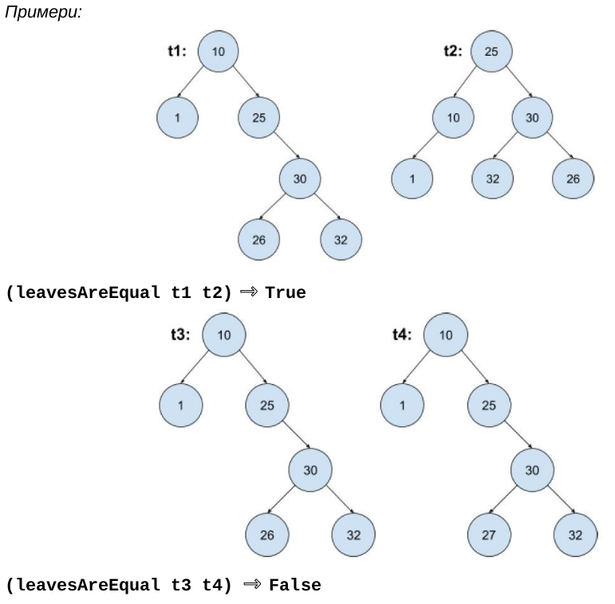

# 🎯 Goals for week 12

1. Practice working with prefix trees (the so-called [tries](https://en.wikipedia.org/wiki/Trie)).
2. Practice writing high quality code:
   1. Easy to read.
   2. Safe from bugs.
   3. Ready for change.

> 🗿 **Legend**: ⭐ - Easy | 🌟 - Medium | 💫 - Hard

## 💫 Task 1

**Description:**

Define a function that checks whether a word is present in a binary tree made up of unique characters.

**Acceptance criteria:**

1. All tests pass.

**Test cases:**

```haskell
t1:      a
        / \
       c   b
      / \   \
     f   d   e

t1 :: BTree Char
t1 = Node 'a' (Node 'c' (Node 'f' Nil Nil) (Node 'd' Nil Nil)) (Node 'b' Nil (Node 'e' Nil Nil))

t2 :: BTree Char
t2 = Node 'a' (Node 'c' (Node 'd' Nil Nil) Nil) (Node 'b' Nil Nil)

t3 :: BTree Char
t3 = Node 'a' (Node 'b' (Node 'd' (Node 'h' Nil Nil) (Node 'i' Nil Nil)) (Node 'e' Nil Nil)) (Node 'c' (Node 'f' Nil Nil) (Node 'g' Nil Nil)) 
```

```haskell
print $ containsWord t1 "acd" == True
print $ containsWord t1 "cd" == True
print $ containsWord t1 "af" == False
print $ containsWord t1 "ac" == False
print $ containsWord t1 "acdh" == False
print $ containsWord t1 "b" == False
print $ containsWord t1 "e" == True
print $ containsWord t2 "ab" == True
print $ containsWord t2 "ad" == False
print $ containsWord t3 "bdh" == True
print $ containsWord t3 "bdi" == True
print $ containsWord t3 "ac" == False
```

## 💫 Task 2

**Description:**

Define a function that returns all possible word combinations from a binary tree made up of characters. The order of the words in the result does not matter.

**Acceptance criteria:**

1. All tests pass.

**Test cases:**

```haskell
t1:    a
      / \
     c   b
    / \   \
   f   d   e

t1 :: BTree Char
t1 = Node 'a' (Node 'c' (Node 'f' Nil Nil) (Node 'd' Nil Nil)) (Node 'b' Nil (Node 'e' Nil Nil))

t2 :: BTree Char
t2 = Node 'a' (Node 'c' (Node 'd' Nil Nil) Nil) (Node 'b' Nil Nil)

t3 :: BTree Char
t3 = Node 'a' (Node 'b' (Node 'd' (Node 'h' Nil Nil) (Node 'i' Nil Nil)) (Node 'e' Nil Nil)) (Node 'c' (Node 'f' Nil Nil) (Node 'g' Nil Nil)) 
```

```haskell
print $ genWords t1 == ["abe","acd","acf","be","cd","cf","d","e","f"]
print $ genWords t2 == ["ab","acd","b","cd","d"]
print $ genWords t3 == ["abdh","abdi","abe","acf","acg","bdh","bdi","be","cf","cg","dh","di","e","f","g","h","i"]
```

## ⭐ Task 3

**Description:**

Define a function that returns all words contained in all of the trees passed as a list.

**Acceptance criteria:**

1. The task is solved using folding.

**Test cases:**

```haskell
t1:    a
      / \
     c   b
    / \   \
   f   d   e

t1 :: BTree Char
t1 = Node 'a' (Node 'c' (Node 'f' Nil Nil) (Node 'd' Nil Nil)) (Node 'b' Nil (Node 'e' Nil Nil))

t2 :: BTree Char
t2 = Node 'a' (Node 'c' (Node 'd' Nil Nil) Nil) (Node 'b' Nil Nil)

t3 :: BTree Char
t3 = Node 'a' (Node 'b' (Node 'd' (Node 'h' Nil Nil) (Node 'i' Nil Nil)) (Node 'e' Nil Nil)) (Node 'c' (Node 'f' Nil Nil) (Node 'g' Nil Nil)) 

t4 :: BTree Char
t4 = Node 'a' (Node 'c' (Node 'd' Nil Nil) Nil) (Node 'g' Nil Nil)
```

```haskell
print $ allContain [t1, t2] == ["acd","cd","d"]
print $ allContain [t1, t2, t3] == []
print $ allContain [t3, t4] == ["g"]
```

## For home

### ⭐ Task 1

**Description:**

Define a new data type representing a binary tree of whole numbers. Define a function that returns the sum of the nodes with values between `L` and `R` (inclusive).

**Acceptance criteria:**

1. Add one new test case. Place a comment after it with the words `my test`.
2. All tests pass.

**Test cases:**

`firstTree`:


`secondTree`:


```haskell
print $ rangedSum firstTree 100 50 == 0 -- (L = 100, R = 50)
print $ rangedSum firstTree 7 15 == 32 -- (L = 7, R = 15)
print $ rangedSum firstTree 15 7 == 32 -- (L = 15, R = 7)
print $ rangedSum secondTree 6 10 == 23 -- (L = 6, R = 10)
print $ rangedSum secondTree 10 6 == 23 -- (L = 10, R = 6)
```

### 🌟 Task 2

**Description:**

Define a function that modifies a `BST` so that every node `n` has a new value equal to the sum of the values of the original tree that are greater than or equal to the value of `n`.


**Acceptance criteria:**

1. Add one new test case. Place a comment after it with the words `my test`.
2. All tests pass.

**Test case:**

```haskell
print $ convert tree == (Node 30 (Node 36 (Node 36 Nil Nil) (Node 35 Nil (Node 33 Nil Nil))) (Node 21 (Node 26 Nil Nil) (Node 15 Nil (Node 8 Nil Nil))))
```

### ⭐ Task 3

**Description:**

A binary tree is a `cone` if at every level the sum of the nodes is greater than than the sum at the previous level.

For a binary tree made up of **whole numbers** define the following functions:

- a function that returns the sum of the nodes at level `k`;
- a function that returns whether a tree is a `cone`.

**Acceptance criteria:**

1. Add one new test case. Place a comment after it with the words `my test`.
2. All tests pass.

**Test cases:**

`numberBTree`:


```haskell
print $ levelSum numberBTree 1 == 11 -- (5 + 6)
print $ cone numberBTree == True
```

### ⭐ Task 4

**Description:**




**Acceptance criteria:**

1. Add one new test case. Place a comment after it with the words `my test`.
2. All tests pass.
